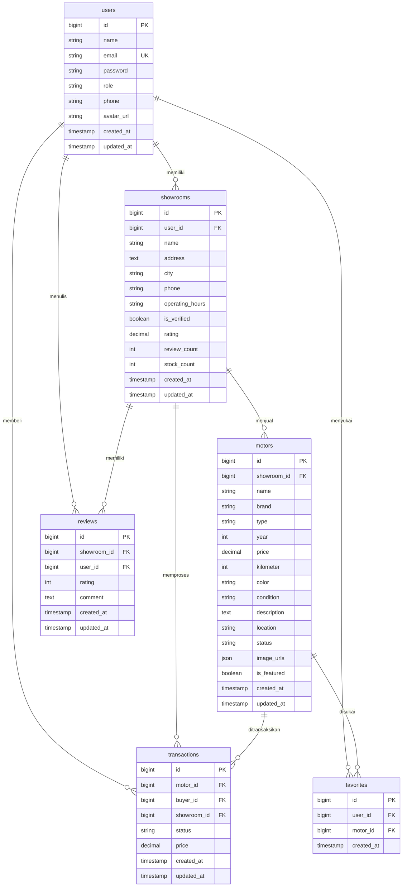

# Entity Relationship Diagram — MotoBekas

## Database Structure

## Relationships

| Table | Related Table | Type | Description |
|-------|--------------|------|-------------|
| users.id | showrooms.user_id | One to Many | User memiliki banyak showroom |
| users.id | favorites.user_id | One to Many | User memiliki banyak favorite |
| users.id | reviews.user_id | One to Many | User menulis banyak review |
| users.id | transactions.buyer_id | One to Many | User membeli banyak motor |
| showrooms.id | motors.showroom_id | One to Many | Showroom menjual banyak motor |
| showrooms.id | reviews.showroom_id | One to Many | Showroom memiliki banyak review |
| showrooms.id | transactions.showroom_id | One to Many | Showroom memproses banyak transaksi |
| motors.id | favorites.motor_id | One to Many | Motor disukai banyak user |
| motors.id | transactions.motor_id | One to Many | Motor ditransaksikan |

## Constraints

- favorites: unique constraint on (user_id, motor_id) — user hanya bisa favorit satu kali per motor
- users.email: unique — tidak boleh ada email duplikat
- users.role: enum('buyer', 'showroom') — hanya dua role yang didukung
- motors.status: enum('tersedia', 'terjual', 'diproses')
- transactions.status: enum('diproses', 'selesai', 'dibatalkan')
